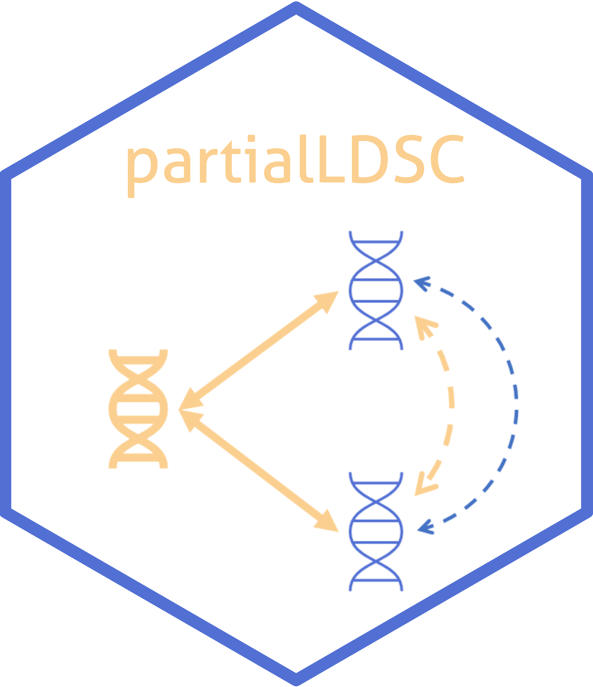

<!-- README.md is generated from README.Rmd. Please edit that file -->

```{r setup, include=FALSE}
knitr::opts_chunk$set(echo = TRUE,
                      fig.path = "doc/Figures/README-",
                      out.width = "100%")
# for tibbles...
options(pillar.neg=F, # do no print neg number in red
        pillar.subtle=F, # turn off highlighting of significant digits
        tibble.width = 170) # default=95, increase it to make it readable


# # automatically updates manual
devtools::build_manual()


library(partialLDSC)

A = readRDS("inst/Data/A.RDS")
B = readRDS("inst/Data/B.RDS")
C = readRDS("inst/Data/C.RDS")

```

# partialLDSC <a href="https://gemini-multimorbidity.github.io/partialLDSC/"></a>

<!-- badges: start -->
[](https://github.com/GEMINI-multimorbidity/partialLDSC)
[](https://github.com/GEMINI-multimorbidity/partialLDSC/commits/master)
[](https://www.tidyverse.org/lifecycle/#experimental)
[](https://zenodo.org/doi/10.5281/zenodo.12721532)
<!-- badges: end -->

## Overview
[//]:*******

`partialLDSC` is an R-package to estimate partial genetic correlations from GWAS summary statistics, and compare them to their unadjusted counterparts, to quantify the contribution of a set potential confounders in explaining genetic similarity between conditions. The partial genetic correlations between two conditions correspond to their genetic correlation, holding the genetic effects of a the potential confounders constant. Differences between unadjusted and partial estimates are not necessarily due to a causal effect of the potential confounders on both conditions and further (causal inference) analyses might be needed to better describe the relationship between the conditions and the potential confounders.    

It relies on cross-trait LD-score regression (LDSC), as first described by [Bulik-Sullivan, B. et al. - “An atlas of genetic correlations across human diseases and traits.”](https://pubmed.ncbi.nlm.nih.gov/26414676/).  

Our implementation of LDSC is based on the one from [`GenomicSEM`](https://github.com/GenomicSEM/GenomicSEM/).  Moreover, the pre-processing of the GWAS summary statistics prior to analysis should be done using the `munge` function they provide.  


There are two main functions available:  

-   **`partial_ldsc()`**  
main function to estimate unadjusted and partial genetic correlations (as well as heritabilities, on the observed scale only), and compare them to each other to assess if adjusting for the potential confounder's genetic significantly affect the pairwise genetic correlation estimates.   


-   **`forest_plot()`**  
main function to visualise the results.     

More details about their usage can be found in the [manual](doc/partialLDSC-manual.pdf).      

For details on the method see our [preprint](https://doi.org/10.1101/2024.07.10.24309772). If you use the package `partialLDSC` please cite:

> Mounier _et al._ (2024) Genetics identifies obesity as a shared risk factor for co-occurring multiple long-term conditions. medRxiv [https://doi.org/10.1101/2024.07.10.24309772](https://doi.org/10.1101/2024.07.10.24309772)

## Installation
[//]:*******

You can install the current version of `partialLDSC` with:    
```{r install-package, echo=TRUE, eval=F, message=FALSE, results='hide'}
# Directly install the package from github
# install.packages("remotes")
remotes::install_github("GEMINI-multimorbidity/partialLDSC")
library(partialLDSC)
```

## Usage
[//]:*******

To run the analysis with `partialLDSC` different inputs are needed:


#### 1. The munged GWAS summary statistics (`conditions` & `confounder`):

More information about how to munge the summary statistics can be found in in the [`ldsc`](https://github.com/bulik/ldsc) command line tool documentation, [here](https://github.com/bulik/ldsc/wiki/Heritability-and-Genetic-Correlation#reformatting-summary-statistics) or in the [`GenomicSEM`](https://github.com/GenomicSEM/GenomicSEM/) R-package documentaion, [here](https://github.com/GenomicSEM/GenomicSEM/wiki/3.-Models-without-Individual-SNP-effects#step-1-munge-the-summary-statistics), to do it directly wihin `R`.    


#### 2. The input files for LDSC (`ld`):

LD scores are needed, these are the same as the ones needed by the [`ldsc`](https://github.com/bulik/ldsc) command line tool and the [`GenomicSEM`](https://github.com/GenomicSEM/GenomicSEM/) R-package and can be directly downloaded from the link they provide.  

> Expects LD scores formated as required by the original LD score regression software. Weights for the european population can be obtained by downloading the eur_w_ld_chr folder in the link below (Note that these are the same weights provided by the original developers of LDSC): https://utexas.box.com/s/vkd36n197m8klbaio3yzoxsee6sxo11v    

The EUR weights are provided within the package Data directory (and are used in the examples). 


### Analysis
[//]:-------------------------------

Before running the examples, please make sure to have downloaded the ld-scores files. You may also need to modify the `ld` parameters to indicate the correct path. Note that when running the analysis with your own GWAS summary statistics, you will first need to properly munge them.   

- **Example A**

```{r exampleA, eval=F}
# Using GEMINI GWAS summary statistics for four conditions 
# (osteoarthitis: OA, type 2 diabetes: T2D, benign hyperplasia of prostate: BPH, coronary heart disease: CHD)
# + a single confounder, GIANT GWAS summary statistics (BMI)
# (1,150,000 SNPs - stored in gzipped files)
OA_file  <- system.file("Data/", "OA_GEMINI.sumstats.gz", package="partialLDSC")
T2D_file <- system.file("Data/", "diabetes_type_2_GEMINI.sumstats.gz", package="partialLDSC")
BPH_file <- system.file("Data/", "BPH_GEMINI.sumstats.gz", package="partialLDSC")
CHD_file <- system.file("Data/", "coronary_heart_GEMINI.sumstats.gz", package="partialLDSC")

BMI_file <- system.file("Data/", "BMI_Yengo_2018.txt.sumstats.gz", package="partialLDSC")

LD_dir   <- file.path(system.file(package="partialLDSC"), "Data", "eur_w_ld_chr")

# launch analysis (using default number of blocks)
A = partial_ldsc(conditions = c(OA_file, T2D_file, BPH_file, CHD_file),
                 confounders = BMI_file, 
                 condition.names = c("OA", "T2D", "BPH", "CHD"), 
                 confounder.names = "BMI",
                 ld = LD_dir,
                 log.name = "Example_A")

``` 


<details>

  <summary>Show log</summary>
  
  ```{r logAdisplay,echo=FALSE, eval=TRUE}
  logA = readr::read_lines(system.file("Data/", "Example_A_ldsc.log", package="partialLDSC"))
  cat(logA, sep="\n")
  ```
  
    
</details>   


- **Example B**

```{r exampleB, eval=F}
# Using GEMINI GWAS summary statistics for two conditions 
# (type 2 diabetes: T2D, coronary heart disease: CHD)
# + a single confounder, GIANT GWAS summary statistics (WHR)
# (1,150,000 SNPs - stored in gzipped files)
T2D_file <- system.file("Data/", "diabetes_type_2_GEMINI.sumstats.gz", package="partialLDSC")
CHD_file <- system.file("Data/", "coronary_heart_GEMINI.sumstats.gz", package="partialLDSC")

WHR_file <- system.file("Data/", "whr.giant-ukbb_2018.gz.sumstats.gz", package="partialLDSC")

LD_dir   <- file.path(system.file(package="partialLDSC"), "Data", "eur_w_ld_chr")

# launch analysis (using default number of blocks)
B = partial_ldsc(conditions = c(T2D_file, CHD_file),
                 confounders = c(WHR_file),
                 condition.names = c("T2D", "CHD"), 
                 confounder.names = c("WHR"),
                 ld = LD_dir,
                 log.name = "Example_B")

``` 


<details>

  <summary>Show log</summary>
  
  ```{r logBdisplay,echo=FALSE, eval=TRUE}
  logB = readr::read_lines(system.file("Data/", "Example_B_ldsc.log", package="partialLDSC"))
  cat(logB, sep="\n")
  ```
  
    
</details>   


- **Example C**

```{r exampleC, eval=F}
# Using GEMINI GWAS summary statistics for two conditions 
# (type 2 diabetes: T2D, coronary heart disease: CHD)
# + two confounders, GIANT GWAS summary statistics (BMI) / (WHR)
# (1,150,000 SNPs - stored in gzipped files)
T2D_file <- system.file("Data/", "diabetes_type_2_GEMINI.sumstats.gz", package="partialLDSC")
CHD_file <- system.file("Data/", "coronary_heart_GEMINI.sumstats.gz", package="partialLDSC")

BMI_file <- system.file("Data/", "BMI_Yengo_2018.txt.sumstats.gz", package="partialLDSC")
WHR_file <- system.file("Data/", "whr.giant-ukbb_2018.gz.sumstats.gz", package="partialLDSC")

LD_dir   <- file.path(system.file(package="partialLDSC"), "Data", "eur_w_ld_chr")

# launch analysis (using default number of blocks)
C = partial_ldsc(conditions = c(T2D_file, CHD_file),
                 confounders = c(BMI_file, WHR_file),
                 condition.names = c("T2D", "CHD"), 
                 confounder.names = c("BMI", "WHR"),
                 ld = LD_dir,
                 log.name = "Example_C")

``` 


<details>

  <summary>Show log</summary>
  
  ```{r logCdisplay,echo=FALSE, eval=TRUE}
  logC = readr::read_lines(system.file("Data/", "Example_C_ldsc.log", package="partialLDSC"))
  cat(logC, sep="\n")
  ```
  
    
</details>   


### Results
[//]:-------------------------------

**`ldsc_partial()`** returns a named list containing the following results:  


- `res_diff` (pairwise results)

`condition.1` : first condition in the pair,   
`condition.2` : second condition in the pair,  
`rg` : unadjusted genetic correlation between the two conditions,    
`rg.SE` : standard error of the unadjusted genetic correlation between the two conditions,       
`partial_rg` : partial genetic correlation between the two conditions,      
`partial_rg.SE` : standard error of the partial genetic correlation between the two conditions,      
`rg_cov` : covariance between the unadjusted and the partial correlation estimates for the pair,      
`diff.T` : test statistic used to test for the difference between the unadjusted and the partial correlation estimates for the pair,     
`diff.P` : p-value corresponding to the test statistic used to test the difference between the unadjusted and the partial correlation estimates for the pair.     

        
- `S` : estimated genetic covariance matrix for all conditions + confounder.    

- `V` : variance covariance matrix of the parameter estimates in `S`.   

- `S_Stand` :  estimated genetic correlation matrix for all conditions + confounder.  

- `V_Stand` : variance covariance matrix of the parameter estimates in `S_Stand`.   

- `partial.S` : estimated partial genetic covariance matrix for all conditions.    

- `partial.V` : variance covariance matrix of the parameter estimates in `partial.S`.   

- `partial.S_Stand` : estimated partial genetic correlation matrix for all conditions.  

- `partial.V_Stand` : variance covariance matrix of the parameter estimates in `partial.S_Stand`.  

- `I` : matrix containing the cross-trait intercepts.   


##### Aditionnaly, log and results files are created in the current working directory :
-   **<log.name>_ldsc.log** - log file   
-   **<log.name>_difference.tsv** - results file   


- **Example A**

```{r resultsA}
### structure of the results

str(A)

### matrix of unadjusted genetic correlations

A$S_Stand

### pairwise results
# in this case, we observed a significant difference between the unadjusted and the partial 
# genetic correlation estimates for OA and T2D, OA and CHD, T2D and CHD. 
# This does make sense since the genetic correlation between BMI and BPH is very low, 
# explaining why adjusting for BMI does not affect the genetic correlation between BPH 
# and the other conditions.

A$res_diff


### functions to list conditions / pairs

get_conditions(A)

get_pairs(A)

### forest plot
forest_plot(A)
```


- **Example B**

```{r resultsB}
### pairwise results
# significant difference between unadjusted and partial genetic correlation adjusting for WHR 

B$res_diff


### forest plot
forest_plot(B)
```


- **Example C**

```{r resultsC}
### matrix of unadjusted genetic correlations
# BMI and WHR are genetically correlated 

C$S_Stand["BMI", "WHR"]


### functions to list confounders

get_confounders(C)

### pairwise results
# adjusting for BMI and WHR jointly, the partial genetic correlation estimate
# is slightly lower than when adjusting for BMI only / WHR only, but the
# this is not an additive effect, because of the correlation between the # two risk factors

C$res_diff
A$res_diff %>% dplyr::filter(condition.1 == "T2D", condition.2 == "CHD")
B$res_diff 

### forest plot
forest_plot(C)
```


## Runtime
[//]:*******

Example A ~ 1 minute(s) and 34 second(s)      
Example B ~ 1 minute(s) and 3 second(s)     
Example C ~ 1 minute(s) and 25 second(s)     


Runtime can be influenced by the number of traits and the number of blocks.


<font color="grey"><small> Results from analyses performed on a Windows 10 laptop - Processor : Intel(R) Core(TM) i5-10310U CPU @ 1.70GHz   2.21 GHz - Memory : 16.0 GB. </font></small>


<!-- ## Contributors -->


## Citation
[//]:*******

If you use the `partialLDSC` package, please cite: ...


## Contact
...
<!-- <mounier.ninon@gmail.com> -->