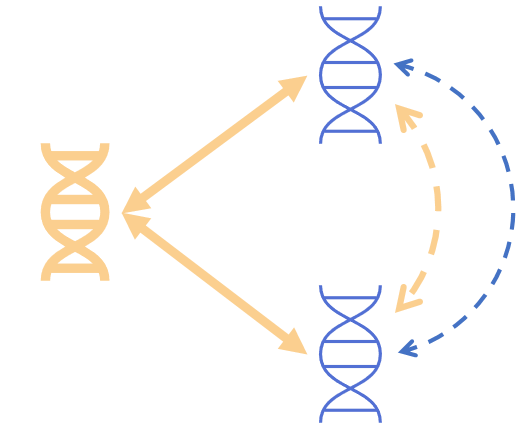

<!-- README.md is generated from README.Rmd. Please edit that file -->

```{r setup, include=FALSE}
knitr::opts_chunk$set(echo = TRUE,
                      fig.path = "doc/Figures/README-",
                      out.width = "100%")
# for tibbles...
options(pillar.neg=F, # do no print neg number in red
        pillar.subtle=F, # turn off highlighting of significant digits
        tibble.width = 170) # default=95, increase it to make it readable


# # automatically updates manual
devtools::build_manual()
system("mv partialLDSC_0.0.0.9.pdf doc/partialLDSC-manual.pdf")
library(partialLDSC)
```

# partialLDSC  
<!-- -->

:information\_source: `partialLDSC` is still under active development.    
<!-- Check the [NEWS](NEWS.md) to learn more about what has been modified\! -->

## Overview
[//]:*******

`partialLDSC` is an R-package to estimate partial genetic correlations from GWAS summary statistics, and compare them to their unadjusted counterparts, to quantify the contribution of a given confounder in explaining genetic similarity between conditions.    
It relies on cross-trait LD-score regression (LDSC), as first described by [Bulik-Sullivan, B. et al. - “An atlas of genetic correlations across human diseases and traits.”](https://pubmed.ncbi.nlm.nih.gov/26414676/).  
Our implementation of LDSC is based on the one from [`GenomicSEM`](https://github.com/GenomicSEM/GenomicSEM/).  Moreover, the pre-processing of the GWAS summary statistics prior to analysis should be done using the `munge` function they provide.  


There are three functions available:  

-   **`ldsc_partial()`**  
main function to estimate unadjusted and partial genetic correlations (as well as heritabilities, on the observed scale only), and compare them to each other to assess if adjusting for the confounder's genetic significantly affect the pairwise genetic correlation estimates.   

-   **`heatmap()`**  
...     

-   **`forest_plot()`**  
...     

More details about its usage can be found in the [manual](doc/partialLDSC-manual.pdf).      

## Installation
[//]:*******

You can install the current version of `partialLDSC` with:    
```{r install-package, echo=TRUE, eval=F, message=FALSE, results='hide'}
# Directly install the package from github
# install.packages("remotes")
remotes::install_github("GEMINI-multimorbidity/partialLDSC")
library(partialLDSC)
```

## Usage
[//]:*******

To run the analysis with `partialLDSC` different inputs are needed:


#### 1. The munged GWAS summary statistics (`conditions` & `confounder`):

More information about how to munge the summary statistics can be found [here](https://github.com/GenomicSEM/GenomicSEM/wiki/3.-Models-without-Individual-SNP-effects#step-1-munge-the-summary-statistics).    


#### 2. The input files for LDSC (`ld`):

LD scores are needed, these are the same as the ones needed by the [`GenomicSEM`](https://github.com/GenomicSEM/GenomicSEM/) R-package and can be directly downloaded from the link they provide.  

> Expects LD scores formated as required by the original LD score regression software. Weights for the european population can be obtained by downloading the eur_w_ld_chr folder in the link below (Note that these are the same weights provided by the original developers of LDSC): https://utexas.box.com/s/vkd36n197m8klbaio3yzoxsee6sxo11v    


### Analysis
[//]:-------------------------------

Before running the examples, please make sure to have downloaded the input files for LDSC. You may also need to modify the `ld` parameters to indicate the correct path.    

- **Example A**

```{r exampleA, eval=F}
# Using GEMINI GWAS summary statistics for three conditions (osteoarthitis: OA, type 2 diabetes: T2D, benign hyperplasia of prostate: BPH) + GIANT GWAS summary statistics for the confounder (BMI) t
# (1,150,000 SNPs - stored in gzipped files)
OA_file <- system.file("data/", "OA_GEMINI.sumstats.gz", package="partialLDSC")
T2D_file <- system.file("data/", "diabetes_type_2_GEMINI.sumstats.gz", package="partialLDSC")
BPH_file <- system.file("data/", "BPH_GEMINI_sumstats.gz", package="partialLDSC")
BMI_file <- system.file("data/", "BMI_Yengo_2018.txt.sumstats.gz", package="partialLDSC")

# launch analysis (using default number of blocks)
A = ldsc_partial(conditions = c(OA_file, T2D_file, BPH_file),
                 confounder = BMI_file, 
                 condition.names = c("OA", "T2D", "BPH"), 
                 confounder.name = "BMI",
                 ld = "~/eur_w_ld_chr",
                 ldsc.log = "Example_A")

``` 


<details>

  <summary>Show log</summary>
  
  ```{r logAdisplay,echo=FALSE, eval=TRUE}
  cat("")
  ```
  
    
</details>   


<!--
- **Example B**
add example with multiple confounder one implemented
-->


### Results
[//]:-------------------------------

**`ldsc_partial()`** returns a named list containing the following results:  


- res_diff (pairwise results)

"condition.1" : first condition in the pair,   
"condition.2" : second condition in the pair,  
"rg" : unadjusted genetic correlation between the two conditions,    
"rg.SE" : standard error of the unadjusted genetic correlation between the two conditions,       
"partial_rg" : partial genetic correlation between the two conditions,      
"partial_rg.SE" : standard error of the partial genetic correlation between the two conditions,      
"rg_cov" : covariance between the unadjusted and the partial correlation estimates for the pair,      
"diff.T" : test statistic used to test for the difference between the unadjusted and the partial correlation estimates for the pair,     
"diff.P" : p-value corresponding to the test statistic used to test the difference between the unadjusted and the partial correlation estimates for the pair.     

        
- S : estimated genetic covariance matrix for all conditions + confounder.    

- V : variance covariance matrix of the parameter estimates in S.   

- S_Stand :  estimated genetic correlation matrix for all conditions + confounder.  

- V_Stand : variance covariance matrix of the parameter estimates in S_Stand.   

- partial.S : estimated partial genetic covariance matrix for all conditions.    

- partial.V : variance covariance matrix of the parameter estimates in partial.S.   

- partial.S_Stand : estimated partial genetic correlation matrix for all conditions.  

- partial.V_Stand : variance covariance matrix of the parameter estimates in partial.S_Stand.  

- I : matrix containing the cross-trait intercepts.   


- **Example A**


## Runtime
[//]:*******

Example A ~   


The runtime can be influenced by the number of traits.


<!-- <font color="grey"><small> Results from analyses performed on a MacBook Pro (2020) - Processor : 2 GHz Quad-Core Intel Core i5 - Memory : 16 GB 3733 MHz LPDDR4X.</font> </small>    -->


## Contributors


## Citation
[//]:*******

If you use the `partialLDSC` package, please cite:


## Contact
<!-- <mounier.ninon@gmail.com> -->