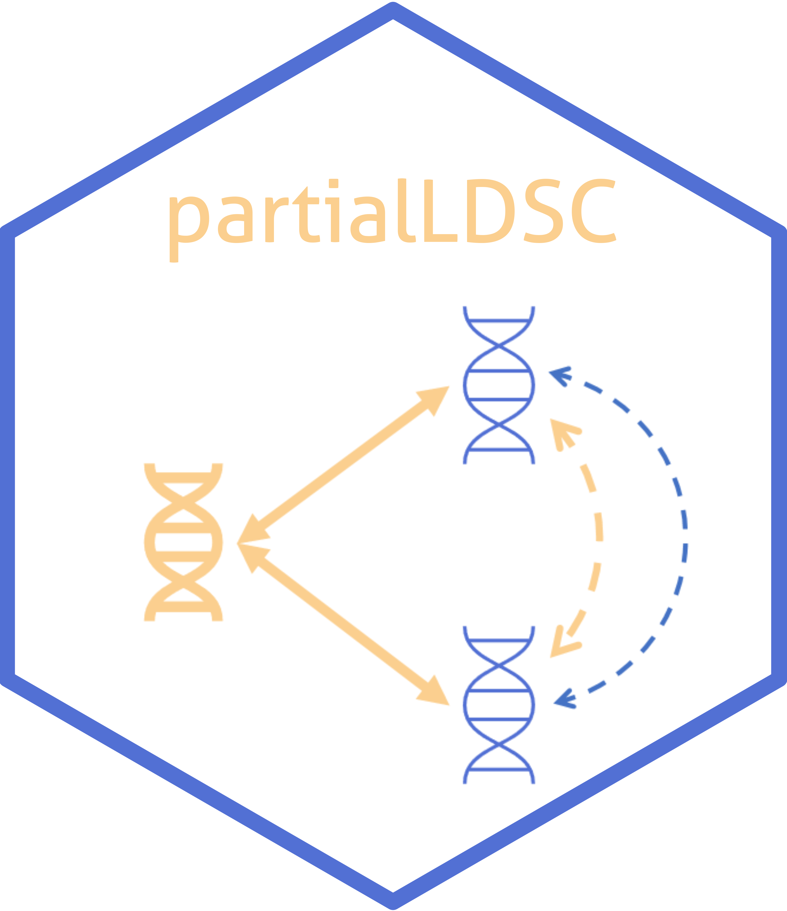

<!-- README.md is generated from README.Rmd. Please edit that file -->

# partialLDSC <a href="https://gemini-multimorbidity.github.io/partialLDSC/"></a>

<!-- badges: start -->
[](https://github.com/GEMINI-multimorbidity/partialLDSC)
[](https://github.com/GEMINI-multimorbidity/partialLDSC/commits/master)
[](https://www.tidyverse.org/lifecycle/#experimental)
[](https://zenodo.org/doi/10.5281/zenodo.12721532)
<!-- badges: end -->

For details on the method see our [preprint](https://doi.org/10.1101/2024.07.10.24309772). If you use the package `partialLDSC` please cite:

> Mounier _et al._ (2024) Genetics identifies obesity as a shared risk factor for co-occurring multiple long-term conditions. medRxiv [https://doi.org/10.1101/2024.07.10.24309772](https://doi.org/10.1101/2024.07.10.24309772)

## Overview

`partialLDSC` is an R-package to estimate partial genetic correlations
from GWAS summary statistics, and compare them to their unadjusted
counterparts, to quantify the contribution of a set potential
confounders in explaining genetic similarity between conditions. The
partial genetic correlations between two conditions correspond to their
genetic correlation, holding the genetic effects of a the potential
confounders constant. Differences between unadjusted and partial
estimates are not necessarily due to a causal effect of the potential
confounders on both conditions and further (causal inference) analyses
might be needed to better describe the relationship between the
conditions and the potential confounders.  

It relies on cross-trait LD-score regression (LDSC), as first described
by [Bulik-Sullivan, B. et al. - “An atlas of genetic correlations across
human diseases and
traits.”](https://pubmed.ncbi.nlm.nih.gov/26414676/).  

Our implementation of LDSC is based on the one from
[`GenomicSEM`](https://github.com/GenomicSEM/GenomicSEM/). Moreover, the
pre-processing of the GWAS summary statistics prior to analysis should
be done using the `munge` function they provide.

There are two main functions available:

-   **`partial_ldsc()`**  
    main function to estimate unadjusted and partial genetic
    correlations (as well as heritabilities, on the observed scale
    only), and compare them to each other to assess if adjusting for the
    potential confounder’s genetic significantly affect the pairwise
    genetic correlation estimates.

-   **`forest_plot()`**  
    main function to visualise the results.

More details about their usage can be found in the
[manual](doc/partialLDSC-manual.pdf).


## Installation

You can install the current version of `partialLDSC` with:

``` r
# Directly install the package from github
# install.packages("remotes")
remotes::install_github("GEMINI-multimorbidity/partialLDSC")
library(partialLDSC)
```

## Usage

To run the analysis with `partialLDSC` different inputs are needed:

#### 1. The munged GWAS summary statistics (`conditions` & `confounder`):

More information about how to munge the summary statistics can be found
in in the [`ldsc`](https://github.com/bulik/ldsc) command line tool
documentation,
[here](https://github.com/bulik/ldsc/wiki/Heritability-and-Genetic-Correlation#reformatting-summary-statistics)
or in the [`GenomicSEM`](https://github.com/GenomicSEM/GenomicSEM/)
R-package documentaion,
[here](https://github.com/GenomicSEM/GenomicSEM/wiki/3.-Models-without-Individual-SNP-effects#step-1-munge-the-summary-statistics),
to do it directly wihin `R`.

#### 2. The input files for LDSC (`ld`):

LD scores are needed, these are the same as the ones needed by the
[`ldsc`](https://github.com/bulik/ldsc) command line tool and the
[`GenomicSEM`](https://github.com/GenomicSEM/GenomicSEM/) R-package and
can be directly downloaded from the link they provide.

> Expects LD scores formated as required by the original LD score
> regression software. Weights for the european population can be
> obtained by downloading the eur\_w\_ld\_chr folder in the link below
> (Note that these are the same weights provided by the original
> developers of LDSC):
> <https://utexas.box.com/s/vkd36n197m8klbaio3yzoxsee6sxo11v>

The EUR weights are provided within the package Data directory (and are used in the examples). 

### Analysis

Before running the examples, please make sure to have downloaded the
ld-scores files. You may also need to modify the `ld` parameters to
indicate the correct path. Note that when running the analysis with your
own GWAS summary statistics, you will first need to properly munge them.

-   **Example A**

``` r
# Using GEMINI GWAS summary statistics for four conditions 
# (osteoarthitis: OA, type 2 diabetes: T2D, benign hyperplasia of prostate: BPH, coronary heart disease: CHD)
# + a single confounder, GIANT GWAS summary statistics (BMI)
# (1,150,000 SNPs - stored in gzipped files)
OA_file  <- system.file("Data/", "OA_GEMINI.sumstats.gz", package="partialLDSC")
T2D_file <- system.file("Data/", "diabetes_type_2_GEMINI.sumstats.gz", package="partialLDSC")
BPH_file <- system.file("Data/", "BPH_GEMINI.sumstats.gz", package="partialLDSC")
CHD_file <- system.file("Data/", "coronary_heart_GEMINI.sumstats.gz", package="partialLDSC")

BMI_file <- system.file("Data/", "BMI_Yengo_2018.txt.sumstats.gz", package="partialLDSC")

# launch analysis (using default number of blocks)
A = partial_ldsc(conditions = c(OA_file, T2D_file, BPH_file, CHD_file),
                 confounders = BMI_file, 
                 condition.names = c("OA", "T2D", "BPH", "CHD"), 
                 confounder.names = "BMI",
                 ld = "~/eur_w_ld_chr",
                 log.name = "Example_A")
```

<details>
<summary>
Show log
</summary>

    ## Multivariate ld-score regression of 5 traits (4 conditions: OA, T2D, BPH, CHD + 1 confounder(s): BMI) began at: 9:40
    ## Number of blocks used to perform the block jacknife used to estimate the sampling covariance matrix (V) is 200
    ## Reading in LD scores from: C:\Users\nm572\OneDrive - University of Exeter\Documents\Exeter\Projects\Data\eur_w_ld_chr
    ## Read in summary statistics [1/5] (OA) from: C:\Users\nm572\OneDrive - University of Exeter\Documents\R\win-library\4.1\partialLDSC\Data\OA_GEMINI.sumstats.gz
    ## Out of 1168143 SNPs, 1155445 remain after merging with LD-score files
    ## Removing 0 SNPs with Chi^2 > 766.622; 1155445 remain
    ## Read in summary statistics [2/5] (T2D) from: C:\Users\nm572\OneDrive - University of Exeter\Documents\R\win-library\4.1\partialLDSC\Data\diabetes_type_2_GEMINI.sumstats.gz
    ## Out of 1161441 SNPs, 1153850 remain after merging with LD-score files
    ## Removing 15 SNPs with Chi^2 > 446.142; 1153835 remain
    ## Read in summary statistics [3/5] (BPH) from: C:\Users\nm572\OneDrive - University of Exeter\Documents\R\win-library\4.1\partialLDSC\Data\BPH_GEMINI.sumstats.gz
    ## Out of 1166954 SNPs, 1160509 remain after merging with LD-score files
    ## Removing 1 SNPs with Chi^2 > 203.231; 1160508 remain
    ## Read in summary statistics [4/5] (CHD) from: C:\Users\nm572\OneDrive - University of Exeter\Documents\R\win-library\4.1\partialLDSC\Data\coronary_heart_GEMINI.sumstats.gz
    ## Out of 1182092 SNPs, 1165543 remain after merging with LD-score files
    ## Removing 10 SNPs with Chi^2 > 567.384; 1165533 remain
    ## Read in summary statistics [5/5] (BMI) from: C:\Users\nm572\OneDrive - University of Exeter\Documents\R\win-library\4.1\partialLDSC\Data\BMI_Yengo_2018.txt.sumstats.gz
    ## Out of 1018130 SNPs, 1014995 remain after merging with LD-score files
    ## Removing 6 SNPs with Chi^2 > 795.64; 1014989 remain
    ##           
    ## Estimating heritability [1/15] for: OA
    ## Heritability Results for trait: OA
    ## Mean Chi^2 across remaining SNPs: 1.4953
    ## Lambda GC: 1.22
    ## Intercept: 0.8991 (0.0113)
    ## Ratio: -0.2036 (0.0229)
    ## Total Observed Scale h2: 0.039 (0.0014)
    ## h2 Z: 28
    ##      
    ## Calculating genetic covariance [2/15] for traits: OA and T2D
    ## 1145694 SNPs remain after merging OA and T2D summary statistics
    ## Results for genetic covariance between: OA and T2D
    ## Mean Z*Z: 0.2186
    ## Cross trait Intercept: 0.0299 (0.0076)
    ## Total Observed Scale Genetic Covariance (g_cov): 0.0158 (0.0016)
    ## g_cov Z: 10.2
    ## g_cov P-value: 3.0229e-24
    ##      
    ## Calculating genetic covariance [3/15] for traits: OA and BPH
    ## 1151912 SNPs remain after merging OA and BPH summary statistics
    ## Results for genetic covariance between: OA and BPH
    ## Mean Z*Z: 0.0934
    ## Cross trait Intercept: 0.0418 (0.0058)
    ## Total Observed Scale Genetic Covariance (g_cov): 0.0064 (0.0016)
    ## g_cov Z: 3.96
    ## g_cov P-value: 7.3987e-05
    ##      
    ## Calculating genetic covariance [4/15] for traits: OA and CHD
    ## 1154806 SNPs remain after merging OA and CHD summary statistics
    ## Results for genetic covariance between: OA and CHD
    ## Mean Z*Z: 0.1405
    ## Cross trait Intercept: 0.0119 (0.0067)
    ## Total Observed Scale Genetic Covariance (g_cov): 0.0103 (0.0011)
    ## g_cov Z: 9.23
    ## g_cov P-value: 2.6289e-20
    ##      
    ## Calculating genetic covariance [5/15] for traits: OA and BMI
    ## 996930 SNPs remain after merging OA and BMI summary statistics
    ## Results for genetic covariance between: OA and BMI
    ## Mean Z*Z: 0.6241
    ## Cross trait Intercept: 0.0446 (0.0112)
    ## Total Observed Scale Genetic Covariance (g_cov): 0.0394 (0.0019)
    ## g_cov Z: 20.5
    ## g_cov P-value: 8.6266e-94
    ##           
    ## Estimating heritability [6/15] for: T2D
    ## Heritability Results for trait: T2D
    ## Mean Chi^2 across remaining SNPs: 2.1342
    ## Lambda GC: 1.4961
    ## Intercept: 1.0054 (0.0259)
    ## Ratio: 0.0048 (0.0229)
    ## Total Observed Scale h2: 0.1307 (0.0055)
    ## h2 Z: 23.8
    ##      
    ## Calculating genetic covariance [7/15] for traits: T2D and BPH
    ## 1151699 SNPs remain after merging T2D and BPH summary statistics
    ## Results for genetic covariance between: T2D and BPH
    ## Mean Z*Z: 0.0113
    ## Cross trait Intercept: -0.0058 (0.0069)
    ## Total Observed Scale Genetic Covariance (g_cov): 0.0042 (0.0027)
    ## g_cov Z: 1.55
    ## g_cov P-value: 0.12162
    ##      
    ## Calculating genetic covariance [8/15] for traits: T2D and CHD
    ## 1153330 SNPs remain after merging T2D and CHD summary statistics
    ## Results for genetic covariance between: T2D and CHD
    ## Mean Z*Z: 0.4608
    ## Cross trait Intercept: 0.1141 (0.009)
    ## Total Observed Scale Genetic Covariance (g_cov): 0.0355 (0.0021)
    ## g_cov Z: 17.1
    ## g_cov P-value: 1.2591e-65
    ##      
    ## Calculating genetic covariance [9/15] for traits: T2D and BMI
    ## 996408 SNPs remain after merging T2D and BMI summary statistics
    ## Results for genetic covariance between: T2D and BMI
    ## Mean Z*Z: 1.0387
    ## Cross trait Intercept: 0.0487 (0.0152)
    ## Total Observed Scale Genetic Covariance (g_cov): 0.0894 (0.0038)
    ## g_cov Z: 23.4
    ## g_cov P-value: 7.1286e-121
    ##           
    ## Estimating heritability [10/15] for: BPH
    ## Heritability Results for trait: BPH
    ## Mean Chi^2 across remaining SNPs: 1.1591
    ## Lambda GC: 0.9517
    ## Intercept: 0.9102 (0.0108)
    ## Ratio: -0.5646 (0.0676)
    ## Total Observed Scale h2: 0.0623 (0.0051)
    ## h2 Z: 12.2
    ##      
    ## Calculating genetic covariance [11/15] for traits: BPH and CHD
    ## 1159621 SNPs remain after merging BPH and CHD summary statistics
    ## Results for genetic covariance between: BPH and CHD
    ## Mean Z*Z: 0.0027
    ## Cross trait Intercept: 0.0067 (0.0055)
    ## Total Observed Scale Genetic Covariance (g_cov): 0 (0.0017)
    ## g_cov Z: -0.0289
    ## g_cov P-value: 0.97691
    ##      
    ## Calculating genetic covariance [12/15] for traits: BPH and BMI
    ## 1001610 SNPs remain after merging BPH and BMI summary statistics
    ## Results for genetic covariance between: BPH and BMI
    ## Mean Z*Z: 0.0049
    ## Cross trait Intercept: 0.01 (0.0101)
    ## Total Observed Scale Genetic Covariance (g_cov): -6e-04 (0.0033)
    ## g_cov Z: -0.175
    ## g_cov P-value: 0.86117
    ##           
    ## Estimating heritability [13/15] for: CHD
    ## Heritability Results for trait: CHD
    ## Mean Chi^2 across remaining SNPs: 1.6958
    ## Lambda GC: 1.2299
    ## Intercept: 0.9168 (0.0196)
    ## Ratio: -0.1196 (0.0281)
    ## Total Observed Scale h2: 0.0704 (0.0035)
    ## h2 Z: 20.2
    ##      
    ## Calculating genetic covariance [14/15] for traits: CHD and BMI
    ## 1003660 SNPs remain after merging CHD and BMI summary statistics
    ## Results for genetic covariance between: CHD and BMI
    ## Mean Z*Z: 0.4431
    ## Cross trait Intercept: 0.015 (0.01)
    ## Total Observed Scale Genetic Covariance (g_cov): 0.0347 (0.0022)
    ## g_cov Z: 16
    ## g_cov P-value: 1.115e-57
    ##           
    ## Estimating heritability [15/15] for: BMI
    ## Heritability Results for trait: BMI
    ## Mean Chi^2 across remaining SNPs: 3.9344
    ## Lambda GC: 2.7869
    ## Intercept: 1.0199 (0.0277)
    ## Ratio: 0.0068 (0.0094)
    ## Total Observed Scale h2: 0.2091 (0.0063)
    ## h2 Z: 33.3
    ##      
    ##       
    ## Genetic Correlation Results
    ## Genetic Correlation between OA and T2D: 0.2216 (0.0208)
    ## Genetic Correlation between OA and BPH: 0.1295 (0.0333)
    ## Genetic Correlation between OA and CHD: 0.1964 (0.0212)
    ## Genetic Correlation between OA and BMI: 0.4361 (0.0182)
    ## Genetic Correlation between T2D and BPH: 0.0462 (0.0303)
    ## Genetic Correlation between T2D and CHD: 0.3705 (0.0173)
    ## Genetic Correlation between T2D and BMI: 0.5408 (0.022)
    ## Genetic Correlation between BPH and CHD: -7e-04 (0.0253)
    ## Genetic Correlation between BPH and BMI: -0.005 (0.0288)
    ## Genetic Correlation between CHD and BMI: 0.2863 (0.018)
    ##      
    ##       
    ## Partial genetic Correlation Results
    ## Partial genetic Correlation between OA and T2D: -0.0189 (0.0296)
    ## Partial genetic Correlation between OA and BPH: 0.1463 (0.0344)
    ## Partial genetic Correlation between OA and CHD: 0.083 (0.0255)
    ## Partial genetic Correlation between T2D and BPH: 0.0581 (0.0315)
    ## Partial genetic Correlation between T2D and CHD: 0.2676 (0.023)
    ## Partial genetic Correlation between BPH and CHD: 7e-04 (0.0253)
    ##      
    ## Analysis finished running at 9:41
    ## Runtime: 1 minute(s) and 34 second(s)
    ## 

</details>

-   **Example B**

``` r
# Using GEMINI GWAS summary statistics for two conditions 
# (type 2 diabetes: T2D, coronary heart disease: CHD)
# + a single confounder, GIANT GWAS summary statistics (WHR)
# (1,150,000 SNPs - stored in gzipped files)
T2D_file <- system.file("Data/", "diabetes_type_2_GEMINI.sumstats.gz", package="partialLDSC")
CHD_file <- system.file("Data/", "coronary_heart_GEMINI.sumstats.gz", package="partialLDSC")
WHR_file <- system.file("Data/", "whr.giant-ukbb_2018.gz.sumstats.gz", package="partialLDSC")

# launch analysis (using default number of blocks)
B = partial_ldsc(conditions = c(T2D_file, CHD_file),
                 confounders = c(WHR_file),
                 condition.names = c("T2D", "CHD"), 
                 confounder.names = c("WHR"),
                 ld = "~/eur_w_ld_chr",
                 log.name = "Example_B")
```

<details>
<summary>
Show log
</summary>

    ## Multivariate ld-score regression of 3 traits (2 conditions: T2D, CHD + 1 confounder(s): WHR) began at: 11:01
    ## Number of blocks used to perform the block jacknife used to estimate the sampling covariance matrix (V) is 200
    ## Reading in LD scores from: C:\Users\nm572\OneDrive - University of Exeter\Documents\Exeter\Projects\Data\eur_w_ld_chr
    ## Read in summary statistics [1/3] (T2D) from: C:\Users\nm572\OneDrive - University of Exeter\Documents\R\win-library\4.1\partialLDSC\Data\diabetes_type_2_GEMINI.sumstats.gz
    ## Out of 1161441 SNPs, 1153850 remain after merging with LD-score files
    ## Removing 15 SNPs with Chi^2 > 446.142; 1153835 remain
    ## Read in summary statistics [2/3] (CHD) from: C:\Users\nm572\OneDrive - University of Exeter\Documents\R\win-library\4.1\partialLDSC\Data\coronary_heart_GEMINI.sumstats.gz
    ## Out of 1182092 SNPs, 1165543 remain after merging with LD-score files
    ## Removing 10 SNPs with Chi^2 > 567.384; 1165533 remain
    ## Read in summary statistics [3/3] (WHR) from: C:\Users\nm572\OneDrive - University of Exeter\Documents\R\win-library\4.1\partialLDSC\Data\whr.giant-ukbb_2018.gz.sumstats.gz
    ## Out of 1201338 SNPs, 1174385 remain after merging with LD-score files
    ## Removing 0 SNPs with Chi^2 > 697.729; 1174385 remain
    ##           
    ## Estimating heritability [1/6] for: T2D
    ## Heritability Results for trait: T2D
    ## Mean Chi^2 across remaining SNPs: 2.1342
    ## Lambda GC: 1.4961
    ## Intercept: 1.0054 (0.0259)
    ## Ratio: 0.0048 (0.0229)
    ## Total Observed Scale h2: 0.1307 (0.0055)
    ## h2 Z: 23.8
    ##      
    ## Calculating genetic covariance [2/6] for traits: T2D and CHD
    ## 1153330 SNPs remain after merging T2D and CHD summary statistics
    ## Results for genetic covariance between: T2D and CHD
    ## Mean Z*Z: 0.4608
    ## Cross trait Intercept: 0.1141 (0.009)
    ## Total Observed Scale Genetic Covariance (g_cov): 0.0355 (0.0021)
    ## g_cov Z: 17.1
    ## g_cov P-value: 1.2591e-65
    ##      
    ## Calculating genetic covariance [3/6] for traits: T2D and WHR
    ## 1145585 SNPs remain after merging T2D and WHR summary statistics
    ## Results for genetic covariance between: T2D and WHR
    ## Mean Z*Z: 0.8532
    ## Cross trait Intercept: 0.0893 (0.0125)
    ## Total Observed Scale Genetic Covariance (g_cov): 0.0755 (0.0031)
    ## g_cov Z: 24.3
    ## g_cov P-value: 8.6189e-131
    ##           
    ## Estimating heritability [4/6] for: CHD
    ## Heritability Results for trait: CHD
    ## Mean Chi^2 across remaining SNPs: 1.6958
    ## Lambda GC: 1.2299
    ## Intercept: 0.9168 (0.0196)
    ## Ratio: -0.1196 (0.0281)
    ## Total Observed Scale h2: 0.0704 (0.0035)
    ## h2 Z: 20.2
    ##      
    ## Calculating genetic covariance [5/6] for traits: CHD and WHR
    ## 1156899 SNPs remain after merging CHD and WHR summary statistics
    ## Results for genetic covariance between: CHD and WHR
    ## Mean Z*Z: 0.4084
    ## Cross trait Intercept: 0.0338 (0.0086)
    ## Total Observed Scale Genetic Covariance (g_cov): 0.0329 (0.0019)
    ## g_cov Z: 17.5
    ## g_cov P-value: 1.0238e-68
    ##           
    ## Estimating heritability [6/6] for: WHR
    ## Heritability Results for trait: WHR
    ## Mean Chi^2 across remaining SNPs: 2.7353
    ## Lambda GC: 2.0939
    ## Intercept: 1.0873 (0.0261)
    ## Ratio: 0.0503 (0.015)
    ## Total Observed Scale h2: 0.1377 (0.0049)
    ## h2 Z: 28.1
    ##      
    ##       
    ## Genetic Correlation Results
    ## Genetic Correlation between T2D and CHD: 0.3705 (0.0173)
    ## Genetic Correlation between T2D and WHR: 0.5628 (0.0168)
    ## Genetic Correlation between CHD and WHR: 0.3342 (0.0167)
    ##      
    ##       
    ## Partial genetic Correlation Results
    ## Partial genetic Correlation between T2D and CHD: 0.2341 (0.0217)
    ##      
    ## Analysis finished running at 11:02
    ## Runtime: 1 minute(s) and 3 second(s)
    ## 

</details>

-   **Example C**

``` r
# Using GEMINI GWAS summary statistics for two conditions 
# (type 2 diabetes: T2D, coronary heart disease: CHD)
# + two confounders, GIANT GWAS summary statistics (BMI) / (WHR)
# (1,150,000 SNPs - stored in gzipped files)
T2D_file <- system.file("Data/", "diabetes_type_2_GEMINI.sumstats.gz", package="partialLDSC")
CHD_file <- system.file("Data/", "coronary_heart_GEMINI.sumstats.gz", package="partialLDSC")

BMI_file <- system.file("Data/", "BMI_Yengo_2018.txt.sumstats.gz", package="partialLDSC")
WHR_file <- system.file("Data/", "whr.giant-ukbb_2018.gz.sumstats.gz", package="partialLDSC")


# launch analysis (using default number of blocks)
C = partial_ldsc(conditions = c(T2D_file, CHD_file),
                 confounders = c(BMI_file, WHR_file),
                 condition.names = c("T2D", "CHD"), 
                 confounder.names = c("BMI", "WHR"),
                 ld = "~/eur_w_ld_chr",
                 log.name = "Example_C")
```

<details>
<summary>
Show log
</summary>

    ## Multivariate ld-score regression of 4 traits (2 conditions: T2D, CHD + 2 confounder(s): BMI, WHR) began at: 11:02
    ## Number of blocks used to perform the block jacknife used to estimate the sampling covariance matrix (V) is 200
    ## Reading in LD scores from: C:\Users\nm572\OneDrive - University of Exeter\Documents\Exeter\Projects\Data\eur_w_ld_chr
    ## Read in summary statistics [1/4] (T2D) from: C:\Users\nm572\OneDrive - University of Exeter\Documents\R\win-library\4.1\partialLDSC\Data\diabetes_type_2_GEMINI.sumstats.gz
    ## Out of 1161441 SNPs, 1153850 remain after merging with LD-score files
    ## Removing 15 SNPs with Chi^2 > 446.142; 1153835 remain
    ## Read in summary statistics [2/4] (CHD) from: C:\Users\nm572\OneDrive - University of Exeter\Documents\R\win-library\4.1\partialLDSC\Data\coronary_heart_GEMINI.sumstats.gz
    ## Out of 1182092 SNPs, 1165543 remain after merging with LD-score files
    ## Removing 10 SNPs with Chi^2 > 567.384; 1165533 remain
    ## Read in summary statistics [3/4] (BMI) from: C:\Users\nm572\OneDrive - University of Exeter\Documents\R\win-library\4.1\partialLDSC\Data\BMI_Yengo_2018.txt.sumstats.gz
    ## Out of 1018130 SNPs, 1014995 remain after merging with LD-score files
    ## Removing 6 SNPs with Chi^2 > 795.64; 1014989 remain
    ## Read in summary statistics [4/4] (WHR) from: C:\Users\nm572\OneDrive - University of Exeter\Documents\R\win-library\4.1\partialLDSC\Data\whr.giant-ukbb_2018.gz.sumstats.gz
    ## Out of 1201338 SNPs, 1174385 remain after merging with LD-score files
    ## Removing 0 SNPs with Chi^2 > 697.729; 1174385 remain
    ##           
    ## Estimating heritability [1/10] for: T2D
    ## Heritability Results for trait: T2D
    ## Mean Chi^2 across remaining SNPs: 2.1342
    ## Lambda GC: 1.4961
    ## Intercept: 1.0054 (0.0259)
    ## Ratio: 0.0048 (0.0229)
    ## Total Observed Scale h2: 0.1307 (0.0055)
    ## h2 Z: 23.8
    ##      
    ## Calculating genetic covariance [2/10] for traits: T2D and CHD
    ## 1153330 SNPs remain after merging T2D and CHD summary statistics
    ## Results for genetic covariance between: T2D and CHD
    ## Mean Z*Z: 0.4608
    ## Cross trait Intercept: 0.1141 (0.009)
    ## Total Observed Scale Genetic Covariance (g_cov): 0.0355 (0.0021)
    ## g_cov Z: 17.1
    ## g_cov P-value: 1.2591e-65
    ##      
    ## Calculating genetic covariance [3/10] for traits: T2D and BMI
    ## 996408 SNPs remain after merging T2D and BMI summary statistics
    ## Results for genetic covariance between: T2D and BMI
    ## Mean Z*Z: 1.0387
    ## Cross trait Intercept: 0.0487 (0.0152)
    ## Total Observed Scale Genetic Covariance (g_cov): 0.0894 (0.0038)
    ## g_cov Z: 23.4
    ## g_cov P-value: 7.1286e-121
    ##      
    ## Calculating genetic covariance [4/10] for traits: T2D and WHR
    ## 1145585 SNPs remain after merging T2D and WHR summary statistics
    ## Results for genetic covariance between: T2D and WHR
    ## Mean Z*Z: 0.8532
    ## Cross trait Intercept: 0.0893 (0.0125)
    ## Total Observed Scale Genetic Covariance (g_cov): 0.0755 (0.0031)
    ## g_cov Z: 24.3
    ## g_cov P-value: 8.6189e-131
    ##           
    ## Estimating heritability [5/10] for: CHD
    ## Heritability Results for trait: CHD
    ## Mean Chi^2 across remaining SNPs: 1.6958
    ## Lambda GC: 1.2299
    ## Intercept: 0.9168 (0.0196)
    ## Ratio: -0.1196 (0.0281)
    ## Total Observed Scale h2: 0.0704 (0.0035)
    ## h2 Z: 20.2
    ##      
    ## Calculating genetic covariance [6/10] for traits: CHD and BMI
    ## 1003660 SNPs remain after merging CHD and BMI summary statistics
    ## Results for genetic covariance between: CHD and BMI
    ## Mean Z*Z: 0.4431
    ## Cross trait Intercept: 0.015 (0.01)
    ## Total Observed Scale Genetic Covariance (g_cov): 0.0347 (0.0022)
    ## g_cov Z: 16
    ## g_cov P-value: 1.115e-57
    ##      
    ## Calculating genetic covariance [7/10] for traits: CHD and WHR
    ## 1156899 SNPs remain after merging CHD and WHR summary statistics
    ## Results for genetic covariance between: CHD and WHR
    ## Mean Z*Z: 0.4084
    ## Cross trait Intercept: 0.0338 (0.0086)
    ## Total Observed Scale Genetic Covariance (g_cov): 0.0329 (0.0019)
    ## g_cov Z: 17.5
    ## g_cov P-value: 1.0238e-68
    ##           
    ## Estimating heritability [8/10] for: BMI
    ## Heritability Results for trait: BMI
    ## Mean Chi^2 across remaining SNPs: 3.9344
    ## Lambda GC: 2.7869
    ## Intercept: 1.0199 (0.0277)
    ## Ratio: 0.0068 (0.0094)
    ## Total Observed Scale h2: 0.2091 (0.0063)
    ## h2 Z: 33.3
    ##      
    ## Calculating genetic covariance [9/10] for traits: BMI and WHR
    ## 1014470 SNPs remain after merging BMI and WHR summary statistics
    ## Results for genetic covariance between: BMI and WHR
    ## Mean Z*Z: 1.7411
    ## Cross trait Intercept: 0.4555 (0.0185)
    ## Total Observed Scale Genetic Covariance (g_cov): 0.1 (0.0041)
    ## g_cov Z: 24.5
    ## g_cov P-value: 2.1764e-132
    ##           
    ## Estimating heritability [10/10] for: WHR
    ## Heritability Results for trait: WHR
    ## Mean Chi^2 across remaining SNPs: 2.7353
    ## Lambda GC: 2.0939
    ## Intercept: 1.0873 (0.0261)
    ## Ratio: 0.0503 (0.015)
    ## Total Observed Scale h2: 0.1377 (0.0049)
    ## h2 Z: 28.1
    ##      
    ##       
    ## Genetic Correlation Results
    ## Genetic Correlation between T2D and CHD: 0.3705 (0.0173)
    ## Genetic Correlation between T2D and BMI: 0.5408 (0.022)
    ## Genetic Correlation between T2D and WHR: 0.5628 (0.0168)
    ## Genetic Correlation between CHD and BMI: 0.2863 (0.018)
    ## Genetic Correlation between CHD and WHR: 0.3342 (0.0167)
    ## Genetic Correlation between BMI and WHR: 0.5896 (0.0191)
    ##      
    ##       
    ## Partial genetic Correlation Results
    ## Partial genetic Correlation between T2D and CHD: 0.2093 (0.0231)
    ##      
    ## Analysis finished running at 11:03
    ## Runtime: 1 minute(s) and 25 second(s)
    ## 

</details>

### Results

**`ldsc_partial()`** returns a named list containing the following
results:

-   `res_diff` (pairwise results)

`condition.1` : first condition in the pair,  
`condition.2` : second condition in the pair,  
`rg` : unadjusted genetic correlation between the two conditions,  
`rg.SE` : standard error of the unadjusted genetic correlation between
the two conditions,  
`partial_rg` : partial genetic correlation between the two conditions,  
`partial_rg.SE` : standard error of the partial genetic correlation
between the two conditions,  
`rg_cov` : covariance between the unadjusted and the partial correlation
estimates for the pair,  
`diff.T` : test statistic used to test for the difference between the
unadjusted and the partial correlation estimates for the pair,  
`diff.P` : p-value corresponding to the test statistic used to test the
difference between the unadjusted and the partial correlation estimates
for the pair.

-   `S` : estimated genetic covariance matrix for all conditions +
    confounder.

-   `V` : variance covariance matrix of the parameter estimates in `S`.

-   `S_Stand` : estimated genetic correlation matrix for all
    conditions + confounder.

-   `V_Stand` : variance covariance matrix of the parameter estimates in
    `S_Stand`.

-   `partial.S` : estimated partial genetic covariance matrix for all
    conditions.

-   `partial.V` : variance covariance matrix of the parameter estimates
    in `partial.S`.

-   `partial.S_Stand` : estimated partial genetic correlation matrix for
    all conditions.

-   `partial.V_Stand` : variance covariance matrix of the parameter
    estimates in `partial.S_Stand`.

-   `I` : matrix containing the cross-trait intercepts.

##### Aditionnaly, log and results files are created in the current working directory :

-   \*\*&lt;log.name&gt;\_ldsc.log\*\* - log file  

-   \*\*&lt;log.name&gt;\_difference.tsv\*\* - results file

-   **Example A**

``` r
### structure of the results

str(A)
```

    ## List of 10
    ##  $ res_diff       :'data.frame': 6 obs. of  9 variables:
    ##   ..$ condition.1  : chr [1:6] "OA" "OA" "OA" "T2D" ...
    ##   ..$ condition.2  : chr [1:6] "T2D" "BPH" "CHD" "BPH" ...
    ##   ..$ rg           : num [1:6] 0.2216 0.1295 0.1964 0.0462 0.3705 ...
    ##   ..$ rg.SE        : num [1:6] 0.0208 0.0333 0.0212 0.0303 0.0173 ...
    ##   ..$ partial_rg   : num [1:6] -0.0189 0.1463 0.083 0.0581 0.2676 ...
    ##   ..$ partial_rg.SE: num [1:6] 0.0296 0.0344 0.0255 0.0315 0.023 ...
    ##   ..$ rg_cov       : num [1:6] 0.000451 0.001059 0.000492 0.000819 0.00034 ...
    ##   ..$ diff.T       : num [1:6] 11.92 -1.29 10.41 -0.72 8.39 ...
    ##   ..$ diff.P       : num [1:6] 9.03e-33 1.96e-01 2.32e-25 4.71e-01 4.97e-17 ...
    ##  $ S              : num [1:5, 1:5] 0.03902 0.01582 0.00639 0.0103 0.0394 ...
    ##   ..- attr(*, "dimnames")=List of 2
    ##   .. ..$ : chr [1:5] "OA" "T2D" "BPH" "CHD" ...
    ##   .. ..$ : chr [1:5] "OA" "T2D" "BPH" "CHD" ...
    ##  $ V              : num [1:15, 1:15] 1.94e-06 6.56e-07 -5.20e-09 3.16e-07 8.45e-07 ...
    ##  $ S_Stand        : num [1:5, 1:5] 1 0.222 0.129 0.196 0.436 ...
    ##   ..- attr(*, "dimnames")=List of 2
    ##   .. ..$ : chr [1:5] "OA" "T2D" "BPH" "CHD" ...
    ##   .. ..$ : chr [1:5] "OA" "T2D" "BPH" "CHD" ...
    ##  $ V_Stand        : num [1:15, 1:15] 1.93e-30 2.08e-18 -5.98e-19 -6.00e-19 1.07e-18 ...
    ##  $ partial.S      : num [1:4, 1:4] 0.0316 -0.00102 0.00649 0.00375 -0.00102 ...
    ##   ..- attr(*, "dimnames")=List of 2
    ##   .. ..$ : chr [1:4] "OA" "T2D" "BPH" "CHD"
    ##   .. ..$ : chr [1:4] "OA" "T2D" "BPH" "CHD"
    ##  $ partial.V      : num [1:10, 1:10] 1.83e-06 5.95e-07 3.32e-07 3.69e-07 1.97e-06 ...
    ##  $ partial.S_Stand: num [1:4, 1:4] 1 -0.0189 0.1463 0.083 -0.0189 ...
    ##   ..- attr(*, "dimnames")=List of 2
    ##   .. ..$ : chr [1:4] "OA" "T2D" "BPH" "CHD"
    ##   .. ..$ : chr [1:4] "OA" "T2D" "BPH" "CHD"
    ##  $ partial.V_Stand: num [1:10, 1:10] 0 0 0 0 0 0 0 0 0 0 ...
    ##  $ I              : num [1:5, 1:5] 0.8991 0.0299 0.0418 0.0119 0.0446 ...
    ##   ..- attr(*, "dimnames")=List of 2
    ##   .. ..$ : chr [1:5] "OA" "T2D" "BPH" "CHD" ...
    ##   .. ..$ : chr [1:5] "OA" "T2D" "BPH" "CHD" ...

``` r
### matrix of unadjusted genetic correlations

A$S_Stand
```

    ##            OA        T2D           BPH           CHD          BMI
    ## OA  1.0000000 0.22155702  0.1294993182  0.1964392032  0.436123972
    ## T2D 0.2215570 1.00000000  0.0461693609  0.3704722045  0.540761961
    ## BPH 0.1294993 0.04616936  1.0000000000 -0.0007326979 -0.005027793
    ## CHD 0.1964392 0.37047220 -0.0007326979  1.0000000000  0.286286981
    ## BMI 0.4361240 0.54076196 -0.0050277933  0.2862869809  1.000000000

``` r
### pairwise results
# in this case, we observed a significant difference between the unadjusted and the partial 
# genetic correlation estimates for OA and T2D, OA and CHD, T2D and CHD. 
# This does make sense since the genetic correlation between BMI and BPH is very low, 
# explaining why adjusting for BMI does not affect the genetic correlation between BPH 
# and the other conditions.

A$res_diff
```

    ##   condition.1 condition.2            rg      rg.SE    partial_rg partial_rg.SE
    ## 1          OA         T2D  0.2215570248 0.02076908 -0.0188678115    0.02961074
    ## 2          OA         BPH  0.1294993182 0.03327598  0.1463448004    0.03435472
    ## 3          OA         CHD  0.1964392032 0.02120526  0.0830211735    0.02554427
    ## 4         T2D         BPH  0.0461693609 0.03030614  0.0581196297    0.03154903
    ## 5         T2D         CHD  0.3704722045 0.01733974  0.2675779559    0.02302555
    ## 6         BPH         CHD -0.0007326979 0.02533799  0.0007375748    0.02530307
    ##         rg_cov     diff.T       diff.P
    ## 1 0.0004507507 11.9225545 9.029680e-33
    ## 2 0.0010588452 -1.2925710 1.961595e-01
    ## 3 0.0004916945 10.4064603 2.316763e-25
    ## 4 0.0008192339 -0.7201883 4.714090e-01
    ## 5 0.0003401749  8.3875208 4.965013e-17
    ## 6 0.0006064339 -0.1765008 8.599005e-01

``` r
### functions to list conditions / pairs

get_conditions(A)
```

    ## [1] "OA"  "T2D" "BPH" "CHD"

``` r
get_pairs(A)
```

    ## [1] "OA-T2D"  "OA-BPH"  "OA-CHD"  "T2D-BPH" "T2D-CHD" "BPH-CHD"

``` r
### forest plot
forest_plot(A)
```


-   **Example B**

``` r
### pairwise results
# significant difference between unadjusted and partial genetic correlation adjusting for WHR 

B$res_diff
```

    ##   condition.1 condition.2        rg      rg.SE partial_rg partial_rg.SE
    ## 1         T2D         CHD 0.3704722 0.01733974  0.2341211    0.02170531
    ##         rg_cov   diff.T       diff.P
    ## 1 0.0003230295 12.16025 5.060227e-34

``` r
### forest plot
forest_plot(B)
```


-   **Example C**

``` r
### matrix of unadjusted genetic correlations
# BMI and WHR are genetically correlated 

C$S_Stand["BMI", "WHR"]
```

    ## [1] 0.5895701

``` r
### functions to list confounders

get_confounders(C)
```

    ## [1] "BMI" "WHR"

``` r
### pairwise results
# adjusting for BMI and WHR jointly, the partial genetic correlation estimate
# is slightly lower than when adjusting for BMI only / WHR only, but the
# this is not an additive effect, because of the correlation between the # two risk factors

C$res_diff
```

    ##   condition.1 condition.2        rg      rg.SE partial_rg partial_rg.SE
    ## 1         T2D         CHD 0.3704722 0.01733974  0.2093113    0.02307154
    ##         rg_cov  diff.T       diff.P
    ## 1 0.0003389938 12.9458 2.481581e-38

``` r
A$res_diff %>% dplyr::filter(condition.1 == "T2D", condition.2 == "CHD")
```

    ##   condition.1 condition.2        rg      rg.SE partial_rg partial_rg.SE
    ## 1         T2D         CHD 0.3704722 0.01733974   0.267578    0.02302555
    ##         rg_cov   diff.T       diff.P
    ## 1 0.0003401749 8.387521 4.965013e-17

``` r
B$res_diff 
```

    ##   condition.1 condition.2        rg      rg.SE partial_rg partial_rg.SE
    ## 1         T2D         CHD 0.3704722 0.01733974  0.2341211    0.02170531
    ##         rg_cov   diff.T       diff.P
    ## 1 0.0003230295 12.16025 5.060227e-34

``` r
### forest plot
forest_plot(C)
```


## Runtime

Example A \~ 1 minute(s) and 34 second(s)  
Example B \~ 1 minute(s) and 3 second(s)  
Example C \~ 1 minute(s) and 25 second(s)

Runtime can be influenced by the number of traits and the number of
blocks.

<font color="grey"><small> Results from analyses performed on a Windows
10 laptop - Processor : Intel(R) Core(TM) i5-10310U CPU @ 1.70GHz 2.21
GHz - Memory : 16.0 GB. </font></small>

<!-- ## Contributors -->

## Citation

If you use the `partialLDSC` package, please cite: 

> Mounier _et al._ (2024) Genetics identifies obesity as a shared risk factor for co-occurring multiple long-term conditions. medRxiv [https://doi.org/10.1101/2024.07.10.24309772](https://doi.org/10.1101/2024.07.10.24309772)

## Contact

… <!-- <mounier.ninon@gmail.com> -->
